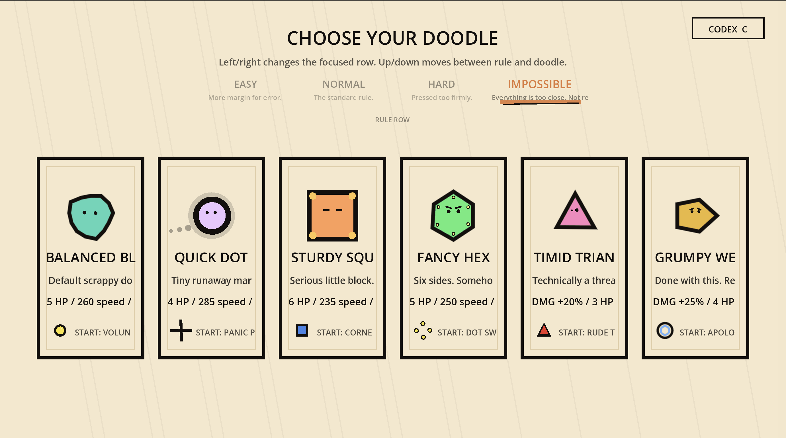
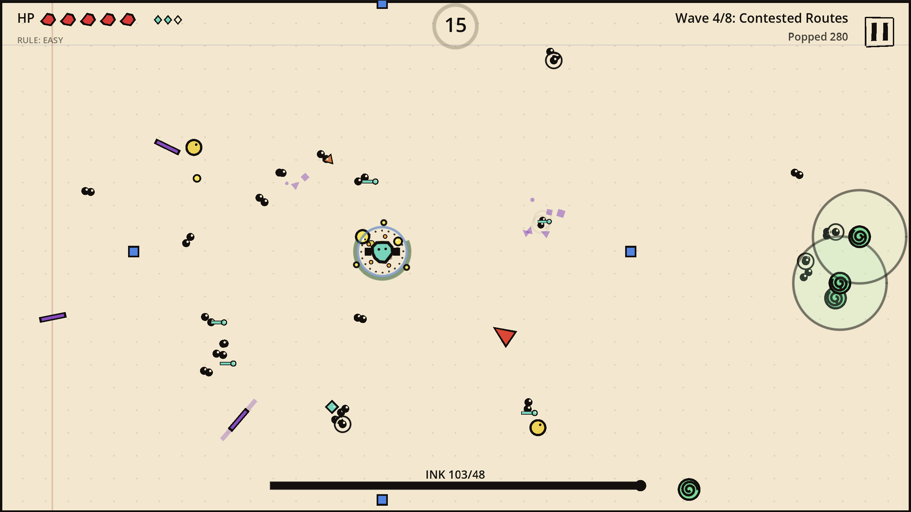
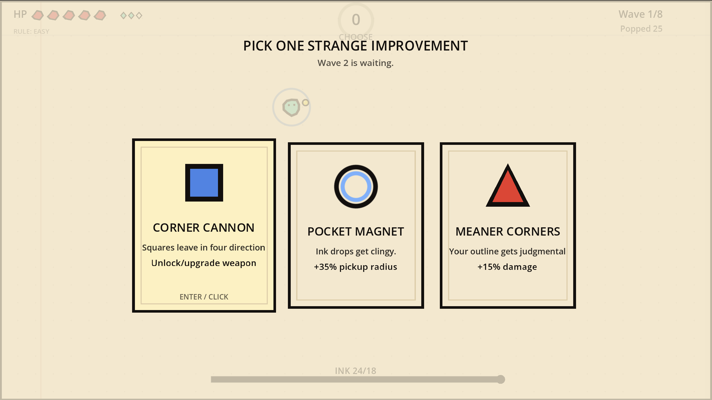
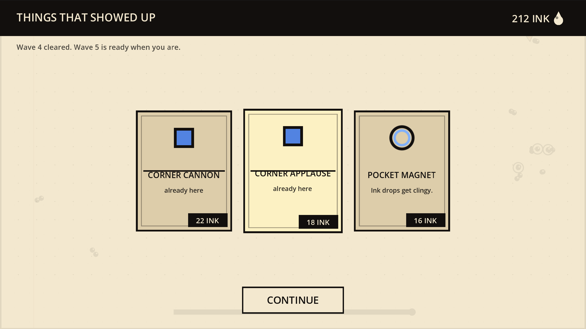
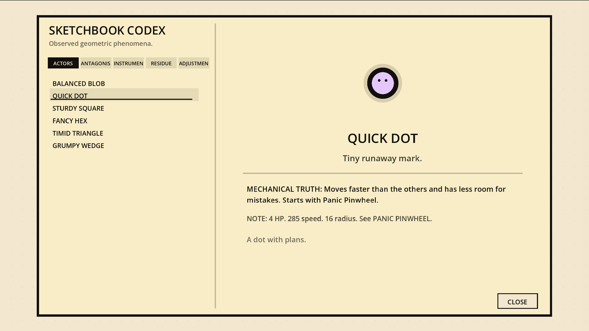

# Shape Survivor

A tiny, hand-doodled survivors-like built in Godot 4.6 with **zero asset files** — every shape, enemy, particle, and UI flourish is procedurally drawn in code on a paper-and-ink canvas.

Pick a nervous doodle, survive eight increasingly mean waves, and draft upgrades between rounds until you either pop the boss or get popped yourself.



## Highlights

- **6 playable doodles** — Balanced Blob, Quick Dot, Sturdy Square, Fancy Hex, Timid Triangle, Grumpy Wedge — each with its own stats, starter weapon, body silhouette, and idle animation.
- **7 weapons** — Volunteer Dot, Panic Pinwheel, Corner Cannon, Dot Swarm, Rude Triangle, Orbit Ruler, Apology Orb — all upgradeable, all drawn from primitives.
- **8 waves + boss** — paced spawns, a shop wave, draft choices between waves, and a final `chunk_polygon` boss that sheds smaller enemies as it loses HP.
- **3 difficulty profiles** — Easy, Normal, Impossible (the last one literally jitters in the menu).
- **Codex** — in-game catalogue of characters, enemies, weapons, and upgrades.
- **Run economy** — ink drops as currency, a between-wave shop, upgrade drafts, and special pickups (speed burst, magnet pulse, damage burst, shield fragments).
- **Pure procedural art** — the entire visual style is `draw_circle`, `draw_polyline`, `draw_colored_polygon` against a cream paper background. No textures, no fonts beyond the default, no audio dependencies. Repo weighs in at ~250 KB of GDScript.

## Controls

| Action | Key |
| --- | --- |
| Move | `WASD` / Arrow keys |
| Confirm | `Enter` / `Space` |
| Pause | `Esc` / `P` |
| Open Codex | `C` |
| Restart (on death) | `R` |

Mouse works on every menu — cards, difficulty row, shop items, and the codex are all clickable.

## Running it

1. Install [Godot 4.6](https://godotengine.org/) (or any 4.x — the project file targets 4.6).
2. Clone this repo.
3. Open `project.godot` in the Godot editor, then hit ▶, or run from CLI:
   ```sh
   godot --path .
   ```

That's it. No package manager, no asset import step, no external dependencies.

## Project layout

```
project.godot              # Godot project config
scenes/main.tscn           # Single root scene
scripts/
  main.gd                  # Game loop, waves, weapons, drafts, shop, draws the arena
  entities/
    player.gd              # Player movement, drawing, damage, visual tags
    enemy.gd               # All enemy kinds + boss behavior
    projectile.gd          # Projectiles for ranged weapons
    pickup.gd              # Ink and special pickups
    effect.gd              # Attack effects, fragments, particles
  ui/
    character_select.gd    # Doodle picker + difficulty row
    hud.gd                 # In-run HUD
    upgrade_draft.gd       # Between-wave upgrade choice
    shop.gd                # Mid-run shop
    pause_overlay.gd
    result_screen.gd
    codex_overlay.gd       # In-game catalogue
    codex_registry.gd      # Codex content
```

## Built with Ordinus

This entire game — design, code, art-via-code, balancing — was built collaboratively with my multi-agent development system **[Ordinus](https://github.com/muratgur/ordinus)**.

Ordinus is a multi-agent setup that coordinates specialized agents (planning, GDScript implementation, visual design, balance review, etc.) over a shared workboard. Shape Survivor was one of its first end-to-end use cases: a complete, playable game shipped as a single Godot project with no human-written code — only human direction.

If you're curious about the workflow, the agent loops, or want to try Ordinus on your own project, the repo is here: **https://github.com/muratgur/ordinus**

## Gallery

|  |  |
| --- | --- |
|  |  |
| *Pick your doodle and difficulty* | *Survive the swarm* |
|  |  |
| *Draft an upgrade between waves* | *Spend ink at the shop* |
|  |  |
| *Codex: characters, enemies, weapons, upgrades* |  |

## License

MIT — see [LICENSE](LICENSE). Use it, fork it, learn from it, ship your own doodle survivor. A credit back to this repo or to Ordinus is appreciated but not required.
